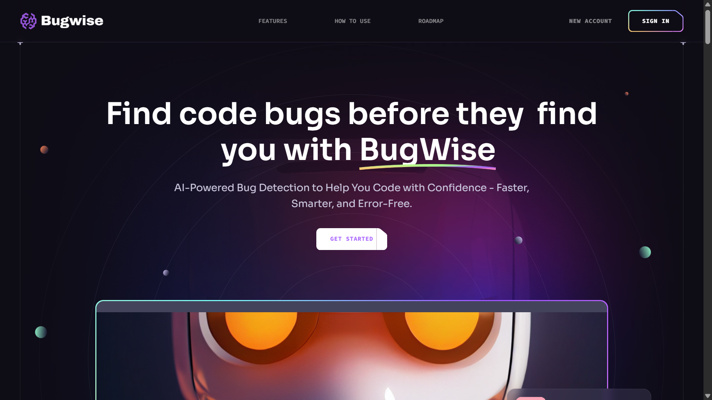
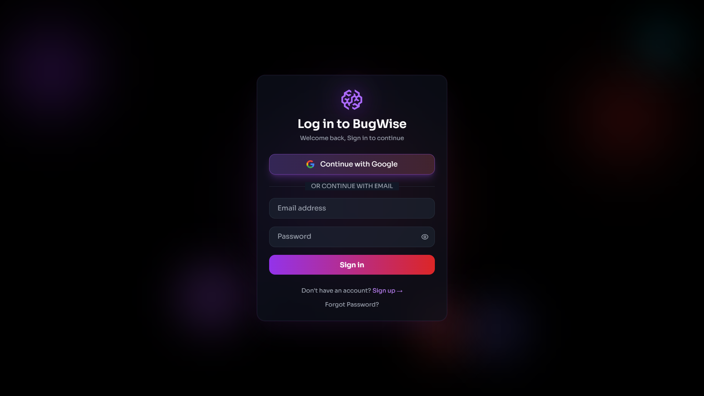
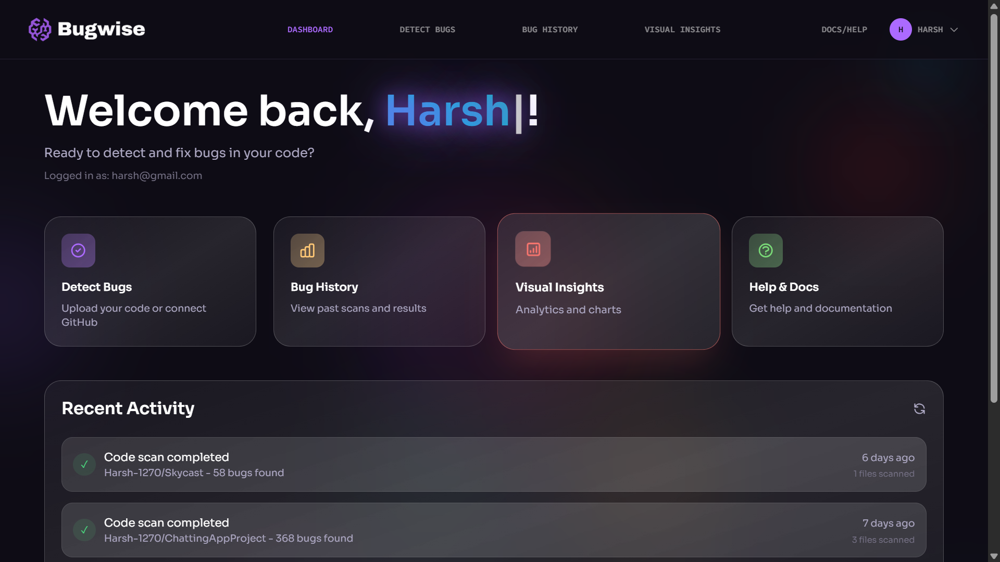
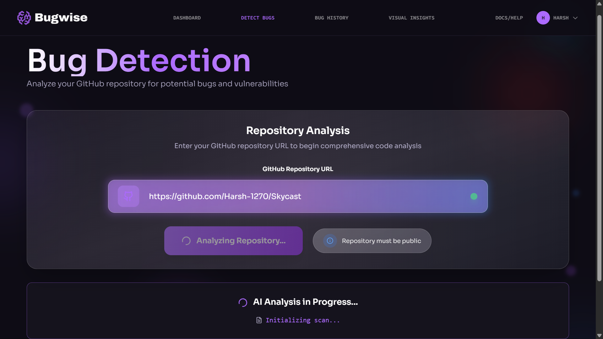
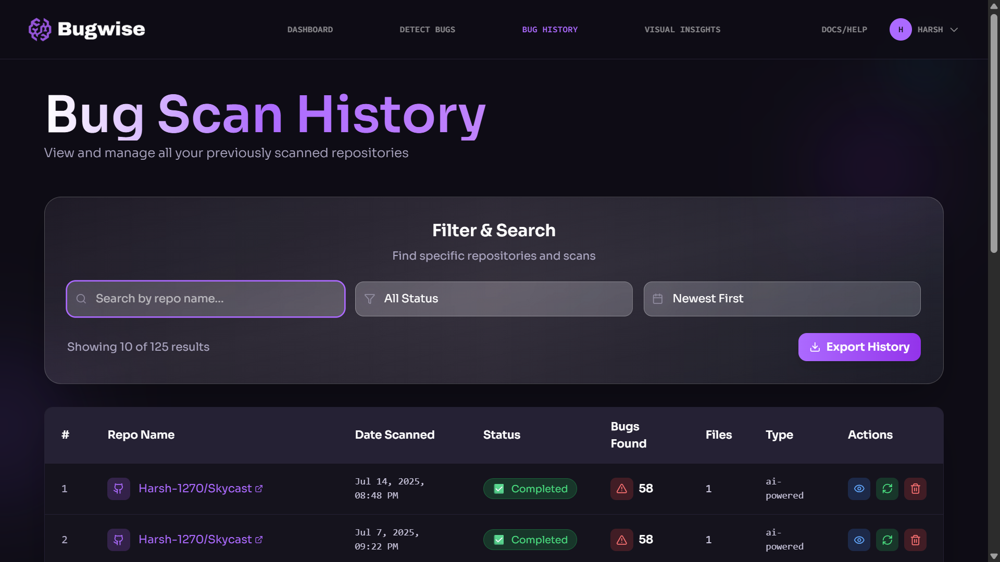
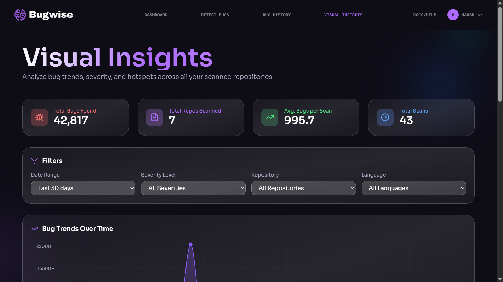
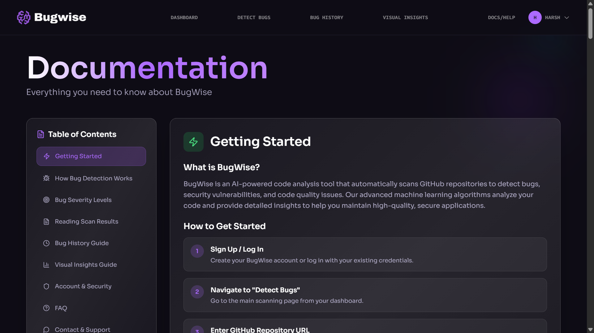
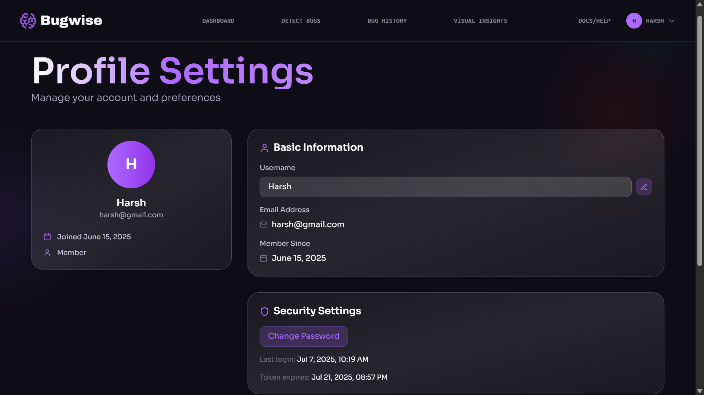

# 🐞 BugWise

BugWise is an AI-powered full-stack web app that detects bugs and vulnerabilities in GitHub repositories using the **CodeBERT** model from HuggingFace. Designed with a clean UI, deep learning backend, and robust scan history features, BugWise empowers developers to find and fix issues quickly.

---

## 📚 Project Pages Overview

### 🏠 Hero Page

- Public landing page for BugWise
- Outlines purpose and features
- Includes navigation to login and docs



---

### 🔐 Login / Signup

- JWT-based authentication system
- Email/password login with error handling
- Secure sessions via HTTP-only cookies



---

### 🧭 Dashboard

- Overview after login
- Displays recent scans and quick stats
- CTA buttons for detecting bugs and viewing insights



---

### 🔍 Detect Bugs

- Input GitHub repo URL
- Calls CodeBERT model to analyze code for bugs
- Shows loading animation and returns detailed bug list


(./screenshots/detect-bugs_2.png)
(./screenshots/detect-bugs_3.png)

---

### 📂 Bug History

- Table of past scans with search and filter
- View scan summaries by repo, date, severity
- Click to view full results


(./screenshots/history_2.png)

---

### 📈 Visual Insights

- Recharts-powered visual analytics
- Severity distribution, bug trends, language stats
- PDF export feature for reports


(./screenshots/visual_insights_2.png)
(./screenshots/visual_insights_3.png)

---

### 📘 Docs / Help

- Guides on how to use BugWise
- Includes limitations, API usage notes, FAQ



---

### 👤 Profile Page

- Shows user info and total scans
- Account management (edit email/password)
- Linked with JWT user context



---

## 🧠 AI Model

- 🔍 Model: CodeBERT (integrated via Hugging Face API)
- 🔑 Authentication: Accessed securely using a Hugging Face token
- 🧠 Trained for bug detection on code datasets
- 🧪 Scans are triggered via backend API call to `/scan`

---

## 🗃️ Folder Structure

### ⚛️ Frontend (`client/`)

client/
├── public/
├── src/
│ ├── assets/
│ ├── components/ # Reusable UI components
│ ├── constants/ # Static values
│ ├── pages/ # All major pages (Login, Detect, Insights, etc.)
│ ├── App.jsx
│ ├── main.jsx
│ └── index.css
├── .env
├── tailwind.config.js
└── vite.config.js


### 🛠️ Backend (`server/`)

server/
├── bug-detector/
├── config/ # DB connection, environment config
├── controllers/
│ └── authController.js
├── middleware/
│ └── auth.js
├── models/ # MongoDB schemas
├── routes/
│ ├── authRoutes.js
│ ├── bugRoutes.js
│ ├── profile.js
│ └── scan.js
├── services/
│ └── aiScanService.js # CodeBERT model
├── utils/
│ └── db.js
├── .env
└── index.js


---

## 🧪 Tech Stack

### Frontend:
- React.js (Vite)
- Tailwind CSS
- Recharts & Lucide React

### Backend:
- Node.js + Express
- MongoDB + Mongoose
- JWT Auth, RESTful APIs

### AI:
- **CodeBERT** (accessed via Hugging Face API)
- Authenticated using Hugging Face token
- Integrated directly into the Node.js backend for scanning GitHub repositories

---

## 🛠️ Getting Started – Run BugWise Locally

Follow these steps to clone and run BugWise on your machine.

### 1. Clone the Repository

```bash
git clone https://github.com/<your-username>/BugWise.git
cd BugWise
````

### 2. Setup Environment Variables

Create two `.env` files:
One inside `client/` and one inside `server/`.

#### `client/.env`

```
VITE_API_URL=http://localhost:5000
```

#### `server/.env`

```
MONGO_URL=<your_mongodb_connection_string>
JWT_SECRET=<your_jwt_secret>
HF_TOKEN=<your_huggingface_api_token>
```

> ⚠️ Replace `<your_...>` values with your actual credentials.

---

### 3. Install Dependencies

**Client (Frontend):**

```bash
cd client
npm install
```

**Server (Backend):**

```bash
cd ../server
npm install
```

---

### 4. Run the Project

In separate terminals, run:

**Frontend:**

```bash
cd client
npm run dev
```

**Backend:**

```bash
cd server
npm start
```

---

### 5. Access the App

Visit [http://localhost:5173](http://localhost:5173) in your browser.

---

## ✅ Requirements

* Node.js ≥ 18.x
* MongoDB (Atlas or local)
* Hugging Face account with API token

---

## ⭐ Star the Repo

If you find BugWise helpful, please ⭐ star the repo and share it with developers!


